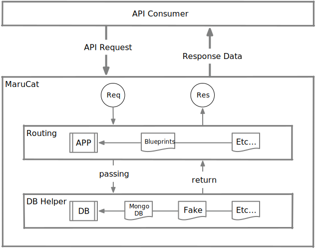

<h1 align="center">MaruCat</h1>

<div align="center"> Maru is my cat. He is Dragon Li.</div>

<br>

<div align="center"></div>

## 定位

> MaruCat is a Back-End service provider for my blog.

MaruCat 是基于 Python 的博客后台程序。

其功能是向前端程序提供 REST 风格的 API 服务。

API 内容：

* 文章和评论相关 API
* 全局设定相关 API

## 依赖

**🍃MongoDB**

MaruCat 依赖 MongoDB 作为持久化层。所有数据在 MongoDB 中持久化。

**🍃PyMongo**

MaruCat 使用 PyMongo 在 Python 中驱动 MongoDB。这个库是必须的。

**🌶️Flask**

MaruCat 使用 Flask 微服务框架提供 REST 风格 API 服务。

## 关于 Blog

**结构**

Blog 前后端分离（🌟）。

前端 UI 使用 React 构建，运行在基于 Node.js 服务器上。

这个服务器作为中间层来调用 MaruCat 的 API。

后端服务提供者，MaruCat 仅关注 API 和数据库操作。

> 🌟：出于学习与研究目的。对 Blog 来说不分离的做法会更简洁。

## API USAGE

### 📝文章相关

包括操作文章和评论的 API。

#### 获取文章列表

```
GET /articles

Query parameters
    size: number, fetch size, 10 by default
    offset: number, counts of skips, 0 by default
    tags: string or strings array, tags 

Example:
    GET /articles?size=10&offset=0
```

可以不给查询参数。

```
GET /articles
```

不给查询参数将等价于下面的请求。

```
GET /articles?size=10&offset=0
```

`size` 一般使用默认值。默认值使用设定值 `default_size`，通常为 `10`。值为 `0` 时将使用设定值中的 `max_size（单次请求拉取最大值）`。

`offset` 默认为 `0`，分页时需要设定。

`tags` 参数可以是一个字符串或者一个字符串数组，默认为空，即获取所有。

响应头中存放一个 `next-page` key，提示是否存在下一页，当其值为 `False` 时表示**不存在下一页**。

##### 状态码

* ✔️ 200 OK
    * 正常
* ✖️ 400 BAD REQUEST
    * size/offset 非数值
    * size/offset 小于0
* ✖️ 404 NOT FOUND
    * 无内容（指定 tags 下）

##### 请求示例

```
$ curl http://127.0.0.1:5000/articles -i
HTTP/1.0 200 OK
Content-Type: application/json
next-page: False
Content-Length: 300
Server: Werkzeug/0.14.1 Python/3.6.5
Date: Mon, 09 Jul 2018 09:26:43 GMT

[
  {
    "_id": "5b432a42f04705565525529d",
    "author": "Richard",
    "deleted": false,
    "peek": "Just a peek at there.",
    "reviews": 5,
    "tags": [
      "OK",
      "red",
      "blue"
    ],
    "timestamp": 1531128386417.8281,
    "title": "The article title",
    "views": 998
  }
]
```

#### 获取文章内容

```
GET /articles/<article_id>

Query parameters
    comments_size: number, fetch comments size, 10 by default

Parameter
    article_id: string, article ID

Example:
    GET /articles/5b33af56d2cbe686e00b75c9?comment_size=10
```

`comments_size` 获取评论数，一般使用默认值。默认值由全局设置中取得，默认为 `10`。

响应头中存放一个 `next-page` key，提示是否存在下一页，当其值为 `False` 时表示**不存在下一页**。

##### 状态码

* ✔️ 200 OK
    * 正常
* ✖️ 404 NOT FOUND
    * article id 未赋值（response 无 error 反馈）
    * article 不存在（response 有 error 反馈）

##### 请求示例

```
$ curl http://127.0.0.1:5000/articles/5b3de906f047053cf2847176?comments_size=2 -i
HTTP/1.0 200 OK
next-page: True
Content-Type: application/json
Content-Length: 655
Server: Werkzeug/0.14.1 Python/3.6.5
Date: Fri, 06 Jul 2018 03:14:50 GMT

{
  "_id": "5b3de906f047053cf2847176",
  "author": "Richard",
  "comments": [
    {
      "aid": "5b3de906f047053cf2847176",
      "body": "Just comment for 0",
      "cid": "5b3de906f047053cf2847177",
      "deleted": false,
      "from": "Mary",
      "timestamp": 1530784006963.624
    },
    {
      "aid": "5b3de906f047053cf2847176",
      "body": "Just comment for 2",
      "cid": "5b3de906f047053cf2847179",
      "deleted": false,
      "from": "Mary",
      "timestamp": 1530784006963.6382
    }
  ],
  "content": "Nothing here",
  "reviews": 5,
  "tags": [
    "OK",
    "red",
    "blue"
  ],
  "timestamp": 1530784006955.605,
  "views": 998
}
```

#### 获取评论

```
GET /articles/<article_id>/comments

Parameter
    article_id: string, article ID

Query parameters
    size: number, fetch size, 10 by default
    offset: number, skip, 0 by default

Example:
    GET /articles/5b3dc242f0470538510b28d6/comment?size=10&offset=1
```

响应头中存放一个 `next-page` key，提示是否存在下一页，当其值为 `False` 时表示**不存在下一页**。

##### 状态码

* ✔️ 200 OK
    * 正常
* ✖️ 400 BAD REQUEST
    * size/offset 非数值
    * size/offset 小于0
* ✖️ 404 NOT FOUND
    * article id 未赋值（response 无 error 反馈）
    * article 不存在（response 有 error 反馈）

##### 请求示例

```
$ curl "http://127.0.0.1:5000/articles/5b3de906f047053cf2847176/comments?size=2&offset=1" -i
HTTP/1.0 200 OK
Content-Type: application/json
Content-Length: 411
Server: Werkzeug/0.14.1 Python/3.6.5
Date: Fri, 06 Jul 2018 02:33:40 GMT

[
  {
    "aid": "5b3de906f047053cf2847176",
    "body": "Just comment for 2",
    "cid": "5b3de906f047053cf2847179",
    "deleted": false,
    "from": "Mary",
    "timestamp": 1530784006963.6382
  },
  {
    "aid": "5b3de906f047053cf2847176",
    "body": "Just comment for 3",
    "cid": "5b3de906f047053cf284717a",
    "deleted": false,
    "from": "Mary",
    "timestamp": 1530784006963.649
  }
]
```

#### 添加评论

```
POST /articles/<article_id>/comments

Parameter
    article_id: string, article ID

Post data
    from: string, user name
    body: string, comment body
    reply_id: string, optional, comment ID for reply to
    timestamp: number, created or updated timestamp

Example:
    POST /articles/5b3dc242f0470538510b28d6/comments
    DATA {
        "from": "Richard",
        "body": "Hi, it's just a comment!",
        "reply_id": "cid12345",
        "timestamp": 1529335011.444969
    }
```

##### 状态码

* ✔️ 201 CREATED
    * 正常
* ✖️ 400 BAD REQUEST
    * data 不合要求/缺少关键信息
* ✖️ 404 NOT FOUND
    * article 不存在

##### 请求示例

```
$ curl "http://127.0.0.1:5000/articles/5b3e2679d2cbe6974cc6e9c2/comments" -i -X POST -d '{"from": "Richard2", "body": "First post comments from api.", "timestamp": "12345"}' -H 'Content-Type: application/json'
HTTP/1.0 201 CREATED
Content-Type: text/html; charset=utf-8
Content-Length: 0
Server: Werkzeug/0.14.1 Python/3.6.4
Date: Sat, 07 Jul 2018 16:10:15 GMT

```

#### 删除评论

```
DELETE /articles/<article_id>/comments/<comment_id>

Parameter
    article_id: string, article ID
    comment_id: string, comment ID

Example:
    DELETE /articles/aid12345/comments/cid12345
```

##### 请求示例

```
curl "http://127.0.0.1:5000/articles/5b3e2679d2cbe6974cc6e9c2/comments/5b40e6e3d2cbe6adb5b60f9b" -i -X DELETE
HTTP/1.0 200 OK
Content-Type: text/html; charset=utf-8
Content-Length: 0
Server: Werkzeug/0.14.1 Python/3.6.4
Date: Sat, 07 Jul 2018 16:14:48 GMT

```

##### 状态码

* ✔️ 200 OK
    * 正常
* ✖️ 404 NOT FOUND
    * article 不存在
    * comment 不存在

#### 获得专栏列表

```
GET /columns/list
```

##### 状态码

* ✔️ 200 OK
    * 正常

#### 获得指定专栏内容

```
GET /columns/<column_id>
```

##### 状态码

* ✔️ 200 OK
    * 正常

### Pending

现在不确定文章内容是否在线编辑和保存，下面的接口可能不会实装。

#### 更新文章

```
PUT /articles/<article_id>
```

##### 状态码

* ✔️ 200 OK
    * 正常

#### 创建文章

```
POST /articles/<article_id>
```

##### 状态码

* ✔️ 201 CREATED
    * 正常

#### 删除文章

```
DELETE /articles/<article_id>
```

##### 状态码

* ✔️ 200 OK
    * 正常

### ⚙全局设定

操作设定的 API。

#### 获取设定

```
GET /settings
```

##### 状态码

* ✔️ 200 OK
    * 正常

#### 更新设定

```
PUT /settings/<items>
```

##### 状态码

* ✔️ 200 OK
    * 正常

#### Settings list

- max_size: 一次请求的最大 size
- default_size: default size
<!--- default_offset: default offset 没意义 -->

### Models

#### Articles & Comments

```python
article = {
    # Article ID
    '_id': '5b33af56d2cbe686e00b75c9',
    # Author
    'author': 'AUTHOR',
    # Peek or abstract
    'peek': 'A peek of content.',
    # Full content
    'content': 'The full content of article.',
    # Counts of views
    'views': 999,
    # Tags
    'tags': ['TAG', 'A', 'B'],
    # Comments
    'comments': [
        {
            # Article ID
            'aid': '5b33af56d2cbe686e00b75c9',
            # Comment ID
            'cid': '5b3dc242f0470538510b28d7',
            # Who wrote the comment
            'from': 'From user',
            # Comment body
            'body': 'Content of comment.',
            # Created or updated timestamp
            'timestamp': 1529248843.301676,
            # Deleted flag
            'deleted': False
        },
        # ...
    ],
    # Counts of comments
    'reviews': 8,
    # Created or updated timestamp
    'timestamp': 1529248869.717813,
    # Deleted flag
    'deleted': False
}
```

#### Columns

```python
colums = {
    'column_id': 'cl1234',
    'Column_name': 'Customize name',
    # TODO
}
```

## 发布&部署

// TODO

## 相关文档

- [在 Flask 框架创建 REST API 的过程和疏通](docs/create-rest-api.md)
- [部署 MongoDB 环境（本地环境和服务器环境）](docs/deploy-mongodb.md)
- [从需求来看 MongoDB （最简用法）](docs/simple-usage-about-mongodb.md)

